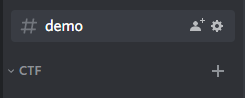
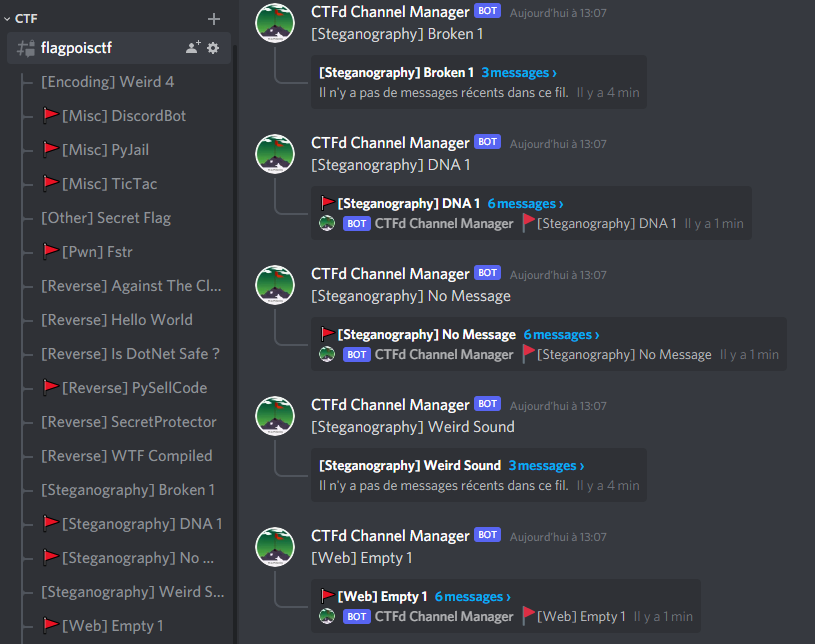

<p align="center">
  
</p>

# Discord bot CTFD-Thread-Parser

# Description:

This tools is used to create automatically discord threads by scraping ctfd plateform and collecting name , category , description and points of challenges.

## Commands :
```
- ?CreateCTFD : Create a channel + threads sorted by name
  |_> Usage: ?CreateCTFD  <Username> <Password> <Url> <ChannelName>

- ?flagged : Store the flag + renamme the challenge thread
  |_> Usage: ?flagged ThisIsMySuperFlag (in challenge thread)

- ?end : Moove the ctfd channel in other category
  |_> Usage: ?end (in ctfd challenge)

- ?gen : Generate new random credentials
  |_> Usage: ?gen (in ctfd challenge)

- ?format : change format flag
  |_> Usage: ?format flag

- ?token : set token account to login & bypass recaptcha
  |_> Usage: ?token mytoken
```

## Usage:
Create a category named ``CTF`` by default *(bot.py line 18)*:



## Installation :

```bash
git clone https://github.com/FlagPoisoning/Discord-CTFD-Parser/Discord-CTFD-Parser.git
cd Discord-CTFD-Parser
python3 -m pip install -r requirements.txt
python3 bot.py
```
*(Don't forget to place your Bot [token](https://discord.com/developers/applications))*

## Screenshot:


## Demo :
https://user-images.githubusercontent.com/61807609/154075676-ae335753-e326-44d0-a0cd-261e431caa30.mp4
